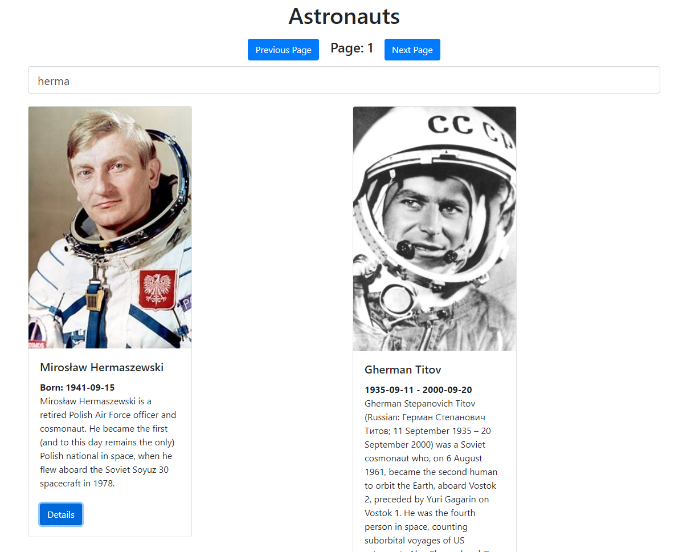

# space-launches-next
🚀 Space launches, astronauts, agencies and more! Built in Next.js




## Getting Started

First, run the development server:

```bash
npm run dev
# or
yarn dev
```

Open [http://localhost:3000](http://localhost:3000) with your browser to see the result.

## Built With
* [Launch Library 2](https://thespacedevs.com/llapi)

## License

This project is licensed under the MIT License - see the LICENSE file for details
